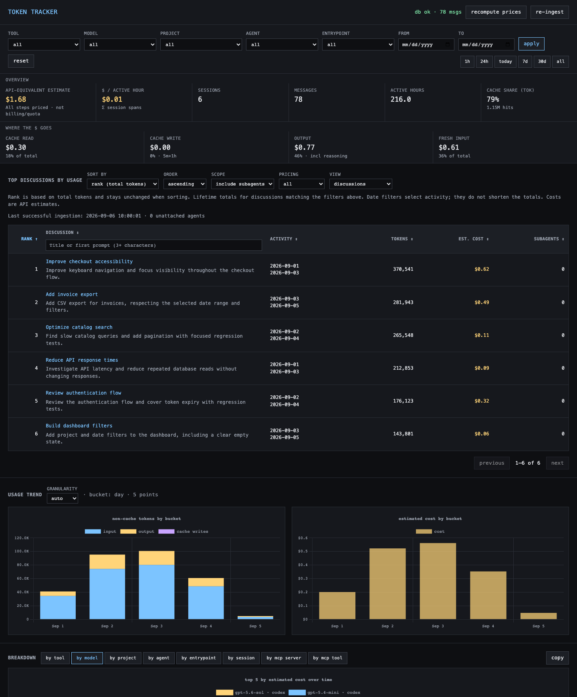

# token-tracker

Local dashboard for Claude Code and Codex (including JetBrains integration logs) token usage and cost. Walks the
JSONL logs each tool already writes, normalizes them into SQLite, and serves a small
web UI with totals, daily charts, per-model / per-project / per-session breakdowns, and
MCP-server usage.

Nothing leaves your machine.

## Why Token Tracker?

Understand which coding discussions consume the most tokens, what drives their estimated cost, and where to investigate potential savings.

- **Prompt usage and estimated cost, directly in your agent’s chat.** See token consumption and estimated cost at the end of each prompt, without opening a separate dashboard. Get a warning when consumption is unusually high and enough history is available. Works with supported agents through simple [AGENTS.md instructions](docs/AGENTS_TOKEN_USAGE.md).

  ```text
  Tokens: 27,987 / input: 477 fresh, 27,264 cached / output 246 / est. cost: $0.04 / MCP: 0 calls.
  ```

- **Claude Code and Codex in one local dashboard**, including Codex sessions from JetBrains. Uses existing logs without changing how you run your agents.
- **Complete discussion totals.** Rank discussions by lifetime usage, include explicitly linked subagents and automatic reviews, and compare their contribution with the main session.
- **Recognizable, searchable discussions.** Find discussions by their Codex title or first prompt, preview the full prompt, and sort the leaderboard.
- **Detailed token accounting.** Separate fresh input, cached input and output, with breakdowns by project and model—even when a session changes models. Repeated usage events are reconciled to avoid double counting.
- **MCP visibility.** Inspect recorded tool calls, errors and text-output size estimates to investigate tool-related overhead.
- **Local data, transparent estimates.** Logs are processed locally. Unknown prices remain explicit, and partial estimates show their pricing coverage.

### How it complements other usage tools

Provider dashboards help track account limits, API spending or organization-wide activity. Token Tracker focuses on understanding local coding work: which discussion consumed the tokens, how projects and models compare, and how much linked agents contributed—with prompt usage and estimated cost reported directly in the conversation.

Estimated costs are API-equivalent comparisons, not invoices or subscription quota measurements. Results depend on the available logs; MCP text-size estimates are not billed token counts. Prompt reports measure newly logged usage for the selected session between two snapshots; they exclude separate agent sessions and the final answer generated after the measurement.



## Discussion leaderboard — 2026-09-06

**Top discussions by usage** ranks complete discussions using lifetime usage from
`tokens.db`, with Codex discussion titles and verified subagents included by default.
Click a title to compare main/child usage, models, token categories and pricing coverage.
The separate Rank column keeps each discussion’s token-based rank when sorting by
other columns. Discussion titles sort alphabetically in their own column.
Click a column header to sort all matching discussions; click again to reverse the
order. Activity sorts by the last recorded activity. The sort/order selectors also
work on mobile, and unknown costs stay last in either direction. The Discussion
header also filters titles and first-prompt text automatically from three characters,
across all pages.

Each discussion now shows its **first user prompt below the title**, truncated to two
lines. Hover to read the complete text; keyboard and touch access are also supported.
Previews load separately after the ranking, use a bounded memory cache, and do not
trigger ingestion or copy prompt text into the databases. Missing/ambiguous prompts
are labeled explicitly. Project and model information remains in the detail view.

- **Previously:** session breakdowns displayed independent sessions and totals within the selected period.
- **Now:** the discussion leaderboard groups explicitly linked child sessions and automatic reviews, without counting Claude's already-grouped subagents twice.
- Titles use Codex `thread_name`, then `threads.name`; missing titles fall back to project/date. Prompt text is never used as a title fallback.
- Date and model filters select discussions while preserving their lifetime totals. Choose main-only usage, pricing coverage, or unattached agents; sort by tokens, known estimated cost, fresh input or output.
- Unknown costs stay **partial** or **unavailable**. The last successful ingestion is shown; opening the leaderboard does not re-ingest logs.

No database migration or rebuild is needed. Restart an existing server after updating
(use `make server-restart` for the server service), then reload the dashboard.
The snapshot API and `AGENTS.md` reporting workflow are unchanged.
See [discussion API, grouping rules and validation](docs/DISCUSSIONS.md).

## Changes and improvements — 2026-09-05

This release includes the Codex accounting repair, partial-cost dashboard and agent usage instructions.

### Report the agent’s token consumption after each prompt.

Copy the [token usage instructions](docs/AGENTS_TOKEN_USAGE.md) into your agent’s `AGENTS.md` for snapshot-based reporting, stop/resume controls and non-blocking error handling. No separate skill is required.

### Changes 

| Area | Previous behavior | Corrected behavior |
|------|-------------------|--------------------| 
| Token accounting | Repeated events could count the same consumption again. | Reconciles cumulative counters with last-step usage; unchanged totals add no consumption. |
| Incremental ingestion | Counter state and pending MCP results could be lost between imports. | Replays the imported prefix to restore state; unchanged files add no usage or duplicate calls. Resets, resumes, compaction and missing fields are handled explicitly. |
| Token categories | Overlapping counters could inflate estimates. | Fresh input excludes cached input; reasoning is already included in output. Cache writes remain a subset of fresh input. |
| MCP coverage | Newer and namespaced call formats were missed. | Supports legacy/custom calls and outputs, namespaced calls, `mcp_tool_call_end` and completed/failed `item_completed` MCP records. Counts execution evidence and deduplicates by source file and call ID. |
| MCP result sizes | Payload size could be mistaken for billed tokens. | Tracks text size, media counts and reported tool/transport errors separately. Text tokens are explicitly estimated as characters ÷ 4; image/audio/base64 payloads are excluded from that estimate. |
| Model pricing | Unknown models, including GPT-5.6 Sol, could silently inherit default rates. | Uses verified explicit model rates and aliases. Unknown prices preserve tokens and remain unpriced. |
| Session attribution | Generic source labels could misidentify JetBrains; final-model attribution could misprice earlier steps. | Preserves originator/source, distinguishes user sessions, guardian reviews and subagents, and retains model/reasoning effort per usage step. |
| Dashboard costs | Any unpriced usage could make the main total unavailable. | Shows the known API-equivalent subtotal with “Partial estimate · N unpriced steps excluded.” A wholly unpriced selection still shows “Unpriced.” |
| Small screens | Summary cards and pricing notes were clipped. | Cards use two columns on narrow screens and pricing notes wrap. |

### How to read the cost display

**Known API-equivalent cost** is the subtotal of usage that can be priced. It is
not a complete total when the partial-estimate label is present, and it is not an
invoice or a measure of subscription quota consumption. The cost breakdown and
cost per active hour use that same known subtotal for a partial selection.

Unpriced review steps still contribute token counts. `codex-auto-review` remains
unpriced because no reliable public rate was established during the repair.
Uncertain usage records can also remain unpriced even when a model has a rate.
No fallback rate is invented to remove the label. API consumers receive strict
unknown totals separately from `pricing_coverage` and `known_cost_breakdown`.

### Validation and existing databases

The repair was validated with **23 regression tests**, plus full-versus-incremental
comparisons on **three real sessions** using temporary databases. Checks covered
duplicates, resets, compaction, cross-import MCP results, errors/media, unknown
pricing and synthetic mixed-model sessions. Re-ingesting unchanged files added
zero usage or calls. Display checks covered partial, fully priced and wholly
unpriced totals; existing small-text/contrast warnings remain in the UI.

For an existing legacy database, prepare and validate a separate candidate first: startup deliberately
rejects incompatible schemas instead of silently rebuilding live data. See
[the rebuild procedure and limitations](docs/CODEX_REPAIR.md). Source logs are
read as data; historical commands are never executed.

## Agent snapshots: start, work, measure

Snapshots now support **Codex and Claude Code main sessions**. Supply a
source-qualified `session_id`: `codex:<session UUID>` or `claude:<session ID>`.
The server advertises `supported_snapshot_sources` in `/api/health`; unsupported
sources return HTTP 422 rather than being interpreted as Codex. Bare IDs still
mean Codex for compatibility. Claude's separate subagent logs are excluded, and
repeated streamed usage records are reconciled by message identity; decreasing
counters or conflicting identities fail explicitly instead of inventing a delta.

The workflow is independent of the client: use any available HTTP tool or curl.
RTK is optional and no Codex-only environment variable is universally required.
Use trusted session metadata from the integration; an agent without a matching
server log adapter cannot measure itself merely by issuing these API calls.

The recommended agent workflow now needs **no turn ID**:

1. Before task execution, POST the agent's session ID to `/api/usage-snapshots` and save the returned `sid`.
2. After the work, POST `/api/usage-snapshots/{sid}/consumption` to refresh logs and receive the delta.

Snapshots isolate the supplied session, excluding other agent sessions. They persist
across restarts in `usage-snapshots.sqlite3`; `tokens.db` is unchanged. Repeated checks
use the original baseline. Warnings compare against prior reported snapshot intervals.
Results measure newly logged usage, so delayed records may cross checkpoint boundaries
and the final check cannot include the answer generated afterward.
See [the agent usage guide](docs/AGENT_USAGE.md) for requests, JetBrains access and limits.

## AGENTS.md instructions: controls and failure handling

Copy [docs/AGENTS_TOKEN_USAGE.md](docs/AGENTS_TOKEN_USAGE.md) into your project's
`AGENTS.md`, or the persistent-instruction mechanism supported by your agent.
Remove any previous instruction to invoke `$prompt-usage` to avoid duplicate
tracking. The former standalone skill has been removed from this repository.

The section contains both API requests, trusted session identification, permission
requests for blocked localhost access, user controls and the exact usage footer.
It contains no personal installation path and requires no separate skill-file read.
Persistent instructions guide the agent; they are not executable pre/post hooks.

### Tracking overhead

The workflow lives directly in agent instructions; detailed recovery guidance
is requested only after an error. The server caches source identities and up to eight parsed
snapshot results. Unchanged files reuse validated results; size, inode or timestamp
changes invalidate them. Changed files still replay and verify source history to
preserve accounting correctness. Discovery continues to check for added/removed
logs. Cold requests and appended logs do not receive the same speedup as repeated
unchanged requests. Agent tool execution and sandbox access can add separate latency.
The displayed usage format is unchanged.

### Compact usage output

The agent reports: `Tokens: TOTAL / input: FRESH fresh, CACHED cached / output OUTPUT /
est. cost: COST / MCP: CALLS calls, ERRORS errors.`
Estimated costs are rounded to two decimal places (for example, `$0.50`).
Only actionable high-usage warnings are appended. Normal/insufficient-history
statuses and routine scope/billing disclaimers are omitted. Partial or unavailable
pricing remains explicit in the cost field; tracking errors are still reported.

### User controls

| Request | Effect |
|---------|--------|
| “Stop measuring token usage” | Disable tracking immediately for this conversation. Abandon the active SID; make no further tracking or diagnostic requests and omit usage footers. |
| “Resume measuring token usage” | Resume from the next prompt with a fresh SID; do not create a late snapshot for the resume request. |
| “Skip tracking for this prompt” | Skip that prompt, abandoning its SID if necessary, and retain the previous tracking preference afterward. |

Equivalent natural wording is accepted. These controls override the mandatory
workflow. The agent preserves the preference across context compaction; they do
not change server settings or disable tracking in other conversations. Steering
messages during ongoing work retain the same SID unless tracking is stopped or
skipped.

After the first tracked prompt of a session, the agent explains the stop, resume
and skip controls once. If tracking is enabled midway through a session, the
notice appears after its first tracked prompt. No reminders are shown while
tracking is disabled.

### Tracking errors do not block the task

If snapshot creation or consumption reporting fails, the agent continues the
user's task and reports **“Usage unavailable”** with the reason at the end. It
never invents zero usage, guesses another session, or creates a late replacement
snapshot to represent the whole task. Without a valid initial SID, the final
consumption request is skipped. Requests use bounded timeouts and do not trigger
retry loops or automatic server restarts.

When server access fails, the agent also suggests: **“If you prefer to continue
without usage checks, say ‘Stop measuring token usage’.”** If the first-prompt
notice is due, it combines the messages rather than repeating them. A failure
does not disable tracking automatically; the user chooses.

When the server responds, recovery guidance is discoverable through
`GET /api/health` → `documentation_url` → `GET /api/docs/operations`.
When unreachable, the agent directs the user to this README for the appropriate
[console or service restart procedure](#server-operations). Sandbox restrictions
and missing session identifiers are distinguished from a stopped server; restarting
a healthy server will not fix those issues.

## Per-prompt usage and warnings for agents

Agents can now request **total consumption for a specific Codex turn** over local
HTTP, including fresh/cached input, output, reasoning, estimated-cost coverage and
MCP calls/errors. `GET /api/prompts` discovers identifiers;
`GET /api/prompt-usage?session_id=…&turn_id=…` returns the report and warning.

The default warning compares against at least 20 completed turns from the same
project, model set, agent type and reasoning effort over 30 days. It flags a metric
only above both its 95th percentile and twice its median. Thresholds are configurable
per request; insufficient history and uncertain boundaries are reported explicitly.

The index refreshes from local logs without changing the database. Reports cover
one session's turn, excluding separate guardian/subagent sessions. A checkpoint
before the final answer reports **usage so far**, not the yet-to-be-generated answer.
No automatic polling or notifications are installed. See [agent setup, examples and
limitations](docs/AGENT_USAGE.md) for copyable requests and an agent instruction.

## Data sources

| Tool   | Path                                                | Per-message tokens                                                                 |
|--------|-----------------------------------------------------|------------------------------------------------------------------------------------|
| Claude | `~/.claude/projects/<encoded-cwd>/<uuid>.jsonl`     | `message.usage.{input,output,cache_read_input,cache_creation_input}_tokens`        |
| Codex  | `~/.codex/sessions/YYYY/MM/DD/rollout-*.jsonl`      | `event_msg:token_count` → reconciled `total_token_usage` and `last_token_usage` |

For Codex, `cached_input_tokens` is a subset of `input_tokens`. We subtract to separate "fresh"
input from cached input so the two tools line up on the same axes.

## Quick start

Requires [uv](https://docs.astral.sh/uv/).

```sh
uv sync                                   # create .venv + install deps
make ingest                               # first run
make server                               # http://127.0.0.1:8732
```

## Periodic ingest (macOS launchd)

```sh
make agent                                # ingests every 5 minutes
make logs                                 # tail ~/Library/Logs/token-tracker.log
make down                                 # uninstall the agent
```

`make up` loads the launchd agent and then starts the server in one step.
The raw scripts (`scripts/run-server.sh`, `scripts/install-launchagent.sh`,
`scripts/uninstall-launchagent.sh`) still work if you'd rather skip make.

The installer drops a plist at `~/Library/LaunchAgents/com.user.token-tracker.plist`
and registers it with `launchctl load -w` — the standard macOS path that EDR/MDM
tools expect.

The web UI also has a **re-ingest** button that triggers `POST /api/reingest` if you don't
want to wait.

### Note for humans and AI coding agents

If you want this server or the ingest job to run in the background, **use the supplied
installer above.** Do not use `launchctl submit` to register it ad-hoc. `launchctl submit`
is a legacy interface that registers a launchd job without writing a plist to disk; many
EDR products (Microsoft Defender for Endpoint, etc.) flag it as suspicious because
file-less persistence is a known malware pattern. The installer in this repo uses the
plist + `launchctl load` flow that EDR tools recognize as legitimate.

For one-off foreground runs, just invoke `./scripts/run-server.sh` directly.

## Server operations

This guidance is also available at `GET /api/docs/operations`, linked by the
`documentation_url` field in `GET /api/health`. The documentation endpoint does
not need a database connection. It describes supported launch methods; it does
not detect which method is currently in use.

### Console-launched server

Stop the server with Ctrl+C in the console that launched it. From the Token Tracker
project directory, run `make server` (or `./scripts/run-server.sh`) again. Keep that
console open. Verify `GET /api/health` responds successfully after restart.

### Service-managed server (macOS)

From the project directory, run `make server-service` to install and start a
per-user LaunchAgent. It starts at user login (not before login), remains available
independently of your coding agent, and restarts automatically if its process exits.
It listens only on `127.0.0.1:8732` and uses the existing `.venv` without code reload.
Run `uv sync` first if the environment is missing. Stop any console server before
installation; the installer refuses an occupied port rather than killing it.

| Command | Action |
|---------|--------|
| `make server-service` | Install/update and start the server service |
| `make server-status` | Check whether the service is loaded |
| `make server-restart` | Restart after code or dependency updates |
| `make server-stop` | Unload now; it can load again at the next login |
| `make server-start` | Start an installed, stopped service |
| `make server-uninstall` | Stop and remove automatic startup |

The generated definition lives at
`~/Library/LaunchAgents/com.user.token-tracker.server.plist`. Paths are resolved at
installation time, not hard-coded in the repository. Logs are written to
`~/Library/Logs/token-tracker-server.log` and
`~/Library/Logs/token-tracker-server.error.log`.

Keep the checkout and its virtual environment available at their installed
location. Before moving the checkout, uninstall the service and reinstall it
from the new location. Do not use `make server` while the service owns the port.
For an independently configured third-party service, use its own service manager.

### Periodic ingestion is separate

The supplied `make agent` / `make down` commands manage the scheduled ingestion
job, not the web server. `make up` loads that ingestion job and then launches the
web server in the foreground. Restarting ingestion alone does not restore an
unavailable HTTP server.

### Access failures

A sandbox or permission restriction can prevent an agent from reaching a healthy
localhost server. Restarting the server does not resolve that restriction; use
the integration's permitted localhost execution route. If the server is unreachable,
online documentation is unavailable too: consult this README using your existing
installation or checkout. Do not guess installation paths, service names, or kill
unidentified port listeners.

## What it tracks

- **Totals & breakdowns**: input / output / cache-read / cache-write / reasoning tokens, cost $.
- **Time series**: daily token & cost charts.
- **Filters**: tool, model, project (cwd), date range — apply across the whole page.
- **MCP servers**: executed call counts, text-result size estimates, separate media counts, and errors; these estimates are not billed usage.
- **Per session**: open any row to see the full message timeline and MCP breakdown.

## Pricing

Edit `prices.json` to update USD-per-1M-token rates. Costs are computed at ingest time. After changing rates, explicitly use the
**recompute prices** button to update stored estimates. Only exact model IDs and explicitly listed aliases are used. Unknown/unverified Codex models retain their tokens with NULL cost. Prices are current standard API-equivalent estimates, not bills or subscription quota usage. Recompute is explicit. See [Codex repair and rebuild](docs/CODEX_REPAIR.md) before using an existing database.

## Layout

```
tracker/         core package
  db.py          schema + sqlite helpers
  parse_claude.py per-file parser (incremental, byte-offset resume)
  parse_codex.py Codex usage and structured MCP parsing
  codex_usage.py cumulative-counter reconciliation
  prompt_usage.py read-only turn index and configurable anomaly comparisons
  rebuild_codex.py prepares a separate database candidate and validation report
  ingest.py      walks both sources, upserts rows
  pricing.py     model → $/1M lookup
  api.py         FastAPI app (/api/stats, /api/mcp, /api/sessions, /api/reingest)
web/             single-page UI (vanilla JS + Chart.js)
scripts/         run-server.sh, run-ingest.sh, launchd plist + install
tests/           accounting, MCP, pricing and rebuild regression checks
prices.json      editable rate card
tokens.db        sqlite (generated; gitignored)
```

## How tokens are attributed

- **Claude**: every `type:"assistant"` line carries a `message.usage` block — we store one
  `messages` row per assistant turn, then sum into `sessions`.
- **Codex**: every `event_msg:token_count` event reports `last_token_usage` (per-turn delta)
  and `total_token_usage` (cumulative). We reconcile both, skip unchanged cumulative events, detect observed counter resets, and replay prefix state across incremental imports. Compaction/resume alone does not reset counters. Ambiguous last-only/partial usage is flagged and unpriced.
- **MCP**: Codex calls are counted from structured results/completions, including
  namespaced calls, legacy/custom outputs, `mcp_tool_call_end`, and completed/failed
  `item_completed:McpToolCall` records (type spelling: `McpToolCall`). Generated calls
  without execution evidence and names mentioned in code are not counted. Multiple
  representations share one call ID per source file. Text characters / 4 is a size
  estimate only; media blocks are counted separately. Exact per-tool billing is unavailable.
- **Classification**: originator overrides generic source labels for the entrypoint;
  user/guardian/subagent kinds are separate. Model and effort are retained per usage
  row, and each MCP call retains the model at invocation when available.


## License

Apache License 2.0 — see [LICENSE](LICENSE).
